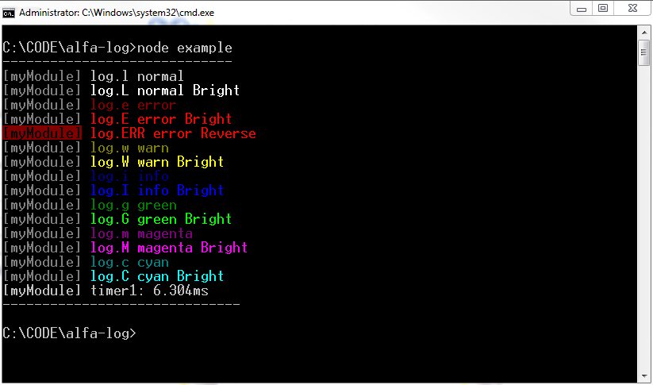

# alfa-log

## console.log in color for NodeJS

usage:
place this in each module:
```javascript
const log = require('alfa-log')('myModuleName');
```
or
```javascript
const log = require('alfa-log')('myModuleName', 'info', 'loaded');
```
optional arguments: `require('alfa-log')(moduleName, level, txt, {bright: true});`
 - moduleName -  prefixes each message with text in square brackets
 - level - used in conjunction with txt, to display log message
 - txt - used in conjunction with level, to display log message
 - options - {bright: true} to make all messages bright

then call log function:
```javascript
log.l('normal message', object1, object2, etc);
log.i('blue message');
log.w('yellow message');
log.e('red message');

log.c('cyan message');
log.g('green message');
log.m('magenta message');
```
to make color brighter use caps:
```javascript
log.L('bright normal message', object1, object2, etc);
log.I('bright blue message');
log.W('bright yellow message');
log.E('bright red message');

log.C('bright cyan message');
log.G('bright green message');
log.M('bright magenta message');
```
test how colors are interpreted by your concole: run `node example.js`
